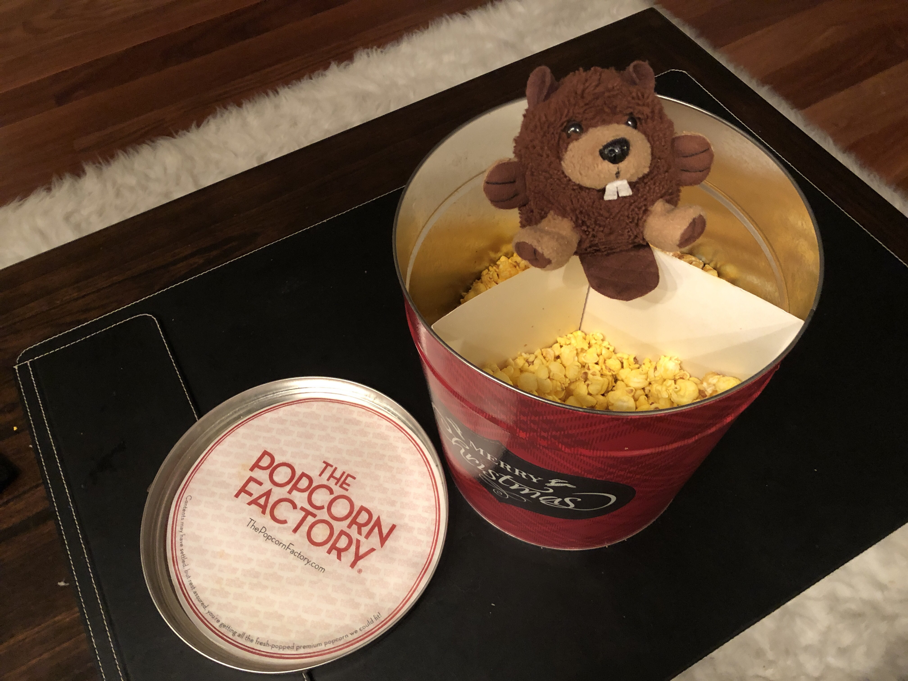

# woodcorn

> just came up with a fun algos problem in the shower.. if anyone wants to give it a shot
> ferrero the woodchuck is tired of being made fun of for not being able to chuck wood. instead of going to the gym to practice throwing things, he's been sitting at home eating this giant tub of popcorn that we got sent for no apparent reason. he realizes that popcorn, like woodchucks, must be made fun of too. presently, he begins to feel bad and becomes a social justice warrior on a mission to right this wrong in the world. 
> 
> given a dictionary of N words with average length L letters, each labeled with noun, verb, both, or none, find all words that can be broken down into "[noun][verb]" or "[verb][noun]" so that they might be oppressed
> ie. "how much would could a woodchuck chuck if a woodchuck could chuck wood"
> or "how much corn could a pop corn pop if a popcorn could pop corn"
> 
> 

Use [`problem/wordlist.txt`](problem/wordlist.txt) as the word list!
